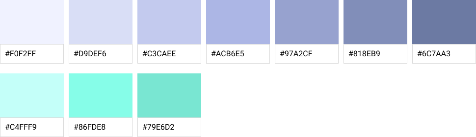
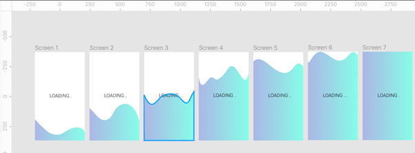

## Interaction Design

#### Located in: https://github.com/asenath247/INTERACTION-DESIGN/new/main?readme=1

## Introduction 
The COM525 is a repository that consists of component library that provide solutions to real-life preoblems. Components are designed by Figma and executed with React, through .js, .css and HTML. 

[1. Hamburger Menu ](#1-Hamburger-Menu)
  * [Research and Introduction](#research)
  * [Evaluation of guidelines](#evaluation-of-guidelines)
  * [Planning and Design prototyping](#planning-and-design-prototyping)
  * [Coding](#coding-)
  * [Walkthrough](#Walkthrough)
  * [Feedback and Reflection](#Feedback)

[2. Login Screen ](#1-Login-Screen)
  * [Research and Introduction](#research)
  * [Evaluation of guidelines](#evaluation-of-guidelines)
  * [Planning and Design prototyping](#planning-and-design-prototyping)
  * [Coding](#coding-)
  * [Walkthrough](#Walkthrough)
  * [Feedback and Reflection](#Feedback)

[3. Loader Screen ](#1-Loader-Screen)
  * [Research and Introduction](#research)
  * [Evaluation of guidelines](#evaluation-of-guidelines)
  * [Planning and Design prototyping](#planning-and-design-prototyping)
  * [Coding](#coding-)
  * [Walkthrough](#Walkthrough)
  * [Feedback and Reflection](#Feedback)

[4. Modal Dialogue ](#1-Modal-Dialogue)
  * [Research and Introduction](#research)
  * [Evaluation of guidelines](#evaluation-of-guidelines)
  * [Planning and Design prototyping](#planning-and-design-prototyping)
  * [Coding](#coding-)
  * [Walkthrough](#Walkthrough)
  * [Feedback and Reflection](#Feedback)

[5. Alerts & Notifications ](#1-notifications)
  * [Research and Introduction](#research)
  * [Evaluation of guidelines](#evaluation-of-guidelines)
  * [Planning and Design prototyping](#planning-and-design-prototyping)
  * [Coding](#coding)
  * [Walkthrough](#Walkthrough)
  * [Feedback and Reflection](#Feedback)

### 1. Hamburger Menu 

### Introduction and Research 
The introductory component is the Hamburger Menu, this is one of the fundamental elements of the user interface. It is required to provide the user with their way around, within a document, application, website etc. According to research, “Navigation is more than search” McGovern (2010), this justifies that it is a necessity for navigation to be included in most cases. The essence of the hamburger menu or sidebar specialises to directly drive the user forward to their destination of content. In this scenario, the purpose of the hamburger menu is to provide the user with insight and unity of what the remaining components. In implementation to this component, I utilised the methodology of the five-stage design thinking model by IDEO (1978) - “Emphasise, Define, Ideate, Prototype and Test”. Taking into the account of the core requirements such as - exploring the functionality and brainstorming, analysing observations and lastly being experimental with my results. All of which synthesise the concept desired. 

 

## Evaluation of guidelines  
Hamburger menus are intended to be a smooth transition from place to place, centralisation on task-oriented access. The structure of this component is required to be most hierarchy. This system is most powerful in predictability. In study, the standard principles and elements of a Hamburger Menu is also essential in success of a basic navigation system.  

Aspects of this component include: 

Content Panel – exclusion of extraneous options, establishing a clear objective 

Iconography – visual illustration of information, e.g., 3 horizontal lines  

Animation – interactive elements such as a sliding or collapsing transition

 

State changes – change in appearance 

Extra elements that could be embedded to a hamburger menu could be imagery and patterns. This is the creative attribute in this type of component. In terms of typography, the hamburger menu usually consists of capitalised font, this is purposely used so that the user locates what they are in search for swiftly and smoothly. For instance, I have the selected the Roboto typeface, with this I capitalised the font in consideration of readability for the user.  

On the other hand, colours and contrast for this specific component is not too emphasised, this is because this component focuses on the navigation and destination for the user.  

To revive the hamburger menu, I used the micro interaction of animation to communicate feedback and state changes to return user-initiated triggers of the systems status. I believe this is significant because it heightens the user experience.  

 

 

 
## Planning & design prototyping 

The planning and prototyping of the hamburger menu does absolute minimalism. The picture below depicts the prototyping and planning of interface, a regular logical approach in development has been taken to accomplish the final concept. The following are used in support of my iteration. The iPhone 8 Plus frames were created, along with plugins such as Material Design Icons. 

## Coding 

 

     

 

## Walkthrough 

 
  

## Feedback & reflection 
The feedback was recorded through a survey of questions. This component had constructive and reflective responses. One participant was able to recommend a visual element interesting to the eye, such as embedding imagery within the hamburger menu. To effectively manage the response, the strong innovative thinking and methodology of “How Might We” (HMV) is used to determine the atmosphere where possible solution can be discovered. In reflection, the research conducted previously was provided by resources of UXplanet and the Artonic Web, all of which revealed design principles used effectively to solve a real-life problem. The hamburger menu successfully executes the usability practices.Valuable learning experience was gained through the development of this hamburger menu, this is a modern approach to current standards of such in the creative industry.  

---
[^1]: Goldman, Shelley. “History.” IDEO | Design Thinking, 2015, designthinking.ideo.com/history#:~:text=IDEO%20is%20often%20credited%20with. Accessed 12 Dec. 2020.

---

## 2. Login Screen

 

 

     

 

          

 

 

### Introduction and Research
Introduction and Research 

The second component presented – the Login Screen, is the gateway to the storage of personal information by user input. It is required to provide feedback to the user in a clear and logical manner. Based on the conducted study, the execution of an accessible interface is most essential, there is a major search for high user experience and user usability. The real-world problem is based on the concept of a portal app intended for university students, the authentication of an existing profile is determined by going through the phases of signing in or creating a new account. In this case, my approach to design presents a series of methodical stages in multi-page login form.  

## Evaluation of guidelines  

 

IxDA (2020), expresses the importance of interactivity between the user and the interface - “Interaction designers strive to create meaningful relationships between people and the products”.  

Producing an accurate guideline ensures the user of straightforward feasibility. To ensure the guidelines are abided by, I investigated the different types of principles and elements for a general login form. In terms of accessibility, this form enlightens the user with their progress through a step-by-step indicator. It also notifies the user when fields are not completed to the right standards. Additionally, users also have chance to skip optional stages or return to the previous page in adaptability to their liking. Overall, I believe users are guided throughout this multi-step form in simplicity. Elements such as text field containers and buttons. Material io articulates the utilisation of crafting efficiently, complying with the user’s requirements. Text fields are to be unique and identified as a contrary to other surrounding elements as it is one of the main aspects of a login form. 

A clear registration form fundamentally comprises of text fields such as: 

 

Username or Email 

Password field 

Login button 

Furthermore, extra elements can be contained, these are: other sign in options - such as google and email, commonly interlinked and incorporated in login screens to simplify the process of filling in a form. Being selective of readable fonts, layouts and avoiding the excessive use of colours and contrasts is significant in the concept of readability. In this case, I utilised the Montserrat typeface, this specific typeface was chosen as it meets the requirements of a clear and strong visual hierarchy. The four main colours chosen are displayed in the image below. This was originally chosen because I wanted to form a flexible trendy combination of a mid-pastel palette.  

## Planning & Design Prototyping 

 

     
     

 

     

 

     

 

     
     

 

The interface elements are precisely coordinated with layout and is representative of a simplified structure. The prototyping and wireframing involves a series of development and iterative sketching. 

Here I also used standard naming conventions to feature my layers and assets in a systematic approach. All components have been defined, differentiated, and effectively deployed.  

 

## Coding 

 

     
     

 

## Walkthrough 

 

     

 
 

## Feedback & reflection 
Once again, the feedback was conducted by the methodology of “How Might We” (HMW), the brainstorming of questions and answers is offered to 5 participants through Google Forms. Feedback from participants indicate their constructive views on this component and its’ features. Various answers showed that the visuals are utmost to the audience and their digital experience. They indicated that the colours are consistently used, which is appealing to the eye and have aspects of Apple interface concepts. However, insightful feedback was also returned, text field could be recreated and positioned to fit the requirements of a standard interface. The feedback and reflection for the design concept has given me a wider insight on areas of improvement, potential solution in re-designing the elements.  

 

     

 

     

 

     

 

[^1]IxDA. “About & History – Interaction Design Association – IxDA.” Ixda.org, 2017, ixda.org/ixda-global/about-history/#:~:text=What%20is%20interaction%20design%3F. Accessed 14 Dec. 2020.

---

## 3. Loader Screen

 

### Introduction and Research 
The objective of the Loader Screen is to show the progress of the application loading. The user requires standard feedback about the ongoing events, this beneficial element assures where the user stands in the process. The loader Screen (also referred to as the splash screen) is described to “sets the scene for the rest of the app, inviting your users in from the cold, sterile apps that they use on a daily basis”. Campbell (2019). It’s aim is to provide immediate indication to the user, and signify the responsiveness of the functionality. “The launch screen isn’t an opportunity for artistic expression. It’s solely intended to enhance the perception of your app as quick to launch and immediately ready for use. Every app must supply a launch screen” Apple (2015). In summary, the minimal modifications are reviewed in detail. 

## Evaluation of guidelines  
The modern approach to displaying these guidelines involve covering the device’s resolution. For instance, in my case I used a portrait iPhone 8 Plus screen to execute this splash screen. Furthermore, two gradient colours were chosen in the palette for this app – #ACB6E5, the secondary colour of COLOUR. Moreover, the colour of #86FDE8 is utilised to contrast precisely. These colours current fit the guidelines of a modern approach essentially, colours have been chosen and researched by the colour psychology to perceive, gain and communicate user awareness and attentiveness. On the other hand, the typography chosen – Roboto is in the colour black #00000. The background in the colour – white, meets the guidelines of appropriate and appealing guidelines to the eye. All colours are displayed in the palette below. The elements are not in excessive use, to give the user a mindset of calmness, this concept is inclusive of conveying an ease of interpretation.

Aspects of a loading screen include –  

Animation – acts to entertain the user as well as indicate the progress of the app 

Text – To also give the user information on what is being done 

Progress indication - to inform the user what’s happening  

In my case, I have included the use of animation through a GIF format. This was chosen to occupy the user with a sense of progress and transition.  

## Planning & design prototyping 
In development, several screens were duplicated to capture the action of this GIF. All screens were exported and performed by TinyImage compress, in order to depict the movement and positioning of elements with the frames. My animation comprises of a simple wave, rising to certain points and then finally to the very top when the loading is finalized. This illustration was supported by the SVG plugin named – Get Waves. This is very useful, as it can adjust and style the complexity of waves or curves in personalisation or completely randomize to liking. The animation of this component is at a speed of 150ms, which is approvable of the waiting time for the user. The final phase of this concept is to showcase in an iPhone 8 Plus frame.  

## Coding 

 

## Walkthrough 

 

## Feedback & reflection 
This component successfully and appropriately solved a real-life problem. In this instance, the user has been communicated to inform and reassure in a speedily manner. In addition to this, the user is also attentive of the motion in this component, the psychological principles of user engagement such as feedback, is expressed to give full information of the current state of the screen. All research has been in impactful in understanding the users needs or services, significant insights have been discovered, and so all elements work together to craft the best solution. The previous research conducted is used in best practices of designing and implementation.

[^1] Campbell, Duncan. “Building the Perfect Splash Screen.” Medium, 9 Mar. 2019, uxdesign.cc/building-the-perfect-splash-screen-46e080395f06. Accessed 8 Dec. 2020.

[^2] Developers Inc., Apple. “Launch Screen - Visual Design - IOS - Human Interface Guidelines - Apple Developer.” Developer.Apple.com, 2015, developer.apple.com/design/human-interface-guidelines/ios/visual-design/launch-screen/. Accessed 8 Jan. 2021.

## 4. Modal Dialogue  

 

### Introduction and Ressearch
As stated by Material UI, “The modal component provides a solid foundation for creating dialogues, popovers and light boxes.” This type of dialogue component is executed too keep visible whilst the background is faded, transparent with the colour grey. Additionally, the word “dialogue” depicts a conversation in this instance, the modal is in conversation with the user, this is because the user requests for information and the modal dialogue approves of that request in return. Additionally, Fessenden (2017) mentions that “Metal dialogues can be used to fragment a complex workflow into simpler steps ”. Fundamentally the modal dialogue principalities include a centred and direct window. 

 

## Evaluation of guidelines  
Producing and fitting this modal dialogue in a modern approach, required containing feasibility. This component blocks content in default and  

displays two combined ellipses. The first ellipse colour is in - #DCA3FF, a light lilac. The second in - #A3C2FF, a mid-blue. Third in - #FBD8DE, a light pink. Lastly, in # CCF9FF, a light blue. All selected colours reflect of a pastel palette.  

The typeface used for this reusable component is - Red Hat Display. This font was chosen as it is suitable to make big statements. To make this design more focused, the elements are in a popover effect, which determines the central positioning of this component. 

In terms of accessibility, this modal dialogue enlightens the user with information from the cause of result, this type of information is transitioned from the main background content. For instance, when completing in a form, the modal dialogue can intervene and notify the user of successful or unaccomplished task. On the other hand, users can exit by clicking the x button to return to the background content, consisting of an efficient transition. 

 

## Planning and design prototyping 

To successfully execute the planning and prototyping, constraints and ruler guidelines are used to have a systematic layout. The simple use of wireframing and fidelity sketching in Figma convey the development of my ideation. Using geometric shape elements such as rectangles to build an illustration. To follow the creative industry standards, my concept follows a subtle, minimalistic theme. Bernadino (2020) at UX collective states that -  “the minimalist design concept invites you to embrace the emptiness and to use it as part of your art.” 

 

## Evaluation of guidelines 
Embarking on the principles for a notification design requires the best for current industry guidelines. The key principles such as, the information communicated, the level of urgency and if action is required, are all considered when design such a component. For instance, the design chosen alerts the user that the storage of the device is full. Users can act on this motivation or move on to sort it out in another time, but this type of notification may regularly occur in reminder for the user. The specific typeface used for this is – Red Hat Display. This was once again chosen to propose big statements which has a clear readability and accessibility.  

Following colours used complement each other in contrast, the primary colour - #1B791F (dark green), white and black all convey the content of the notification well. To focus the user on the message, this alert is positioned in the centre of the screen.  

 

## Planning & Design prototyping  
The animation of this type of component is to appear in a zooming motion. This will ensure that the alert is hierarchy and on top of the content behind the notification. The findability of the notification is in ease of use for the user, this is because the notification is conducted and encouraged to be acted on desirable of the user. 

<img src="https://github.com/asenath247/INTERACTION-DESIGN/blob/main/src/Images/notificationWT.gif"
 

## Feedback and reflection 

The use of geometric shaping was involved due to the popularity. Overall, this component works to perform search for the real-world solution. While effectively complying to the fitting of the creative industry.   

[1^] Iqbal, S. and Horvitz, E. (2010). Notifications and Awareness: A Field Study of Alert Usage and Preferences. www.microsoft.com, [online] 561. Available at: https://www.microsoft.com/en-us/research/publication/notifications-and-awareness-a-field-study-of-alert-usage-and-preferences/ [Accessed 22 Dec. 2020].

 

 

 

 

 

 

 

 

 

 

